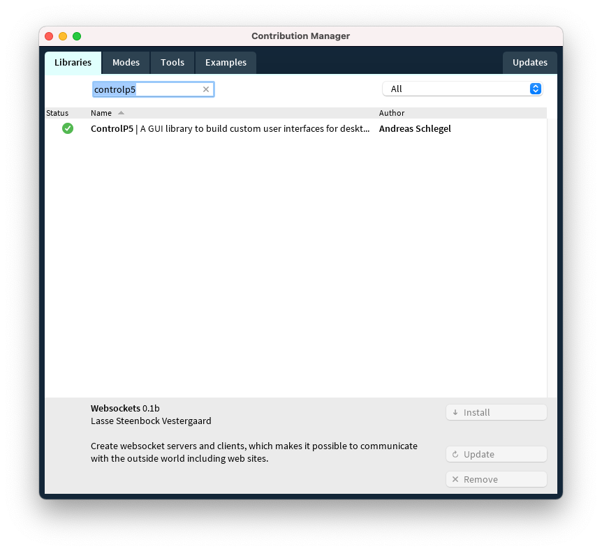
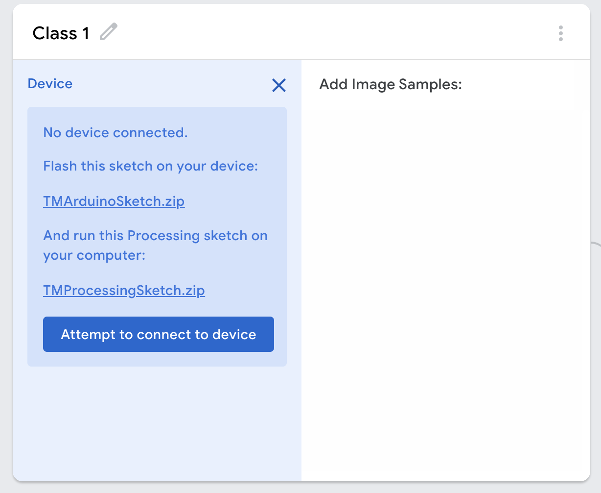
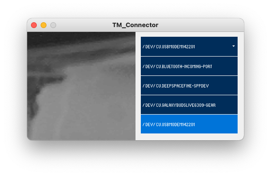
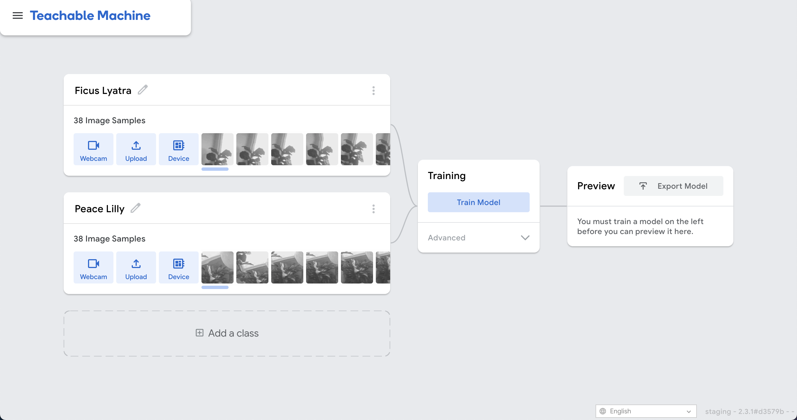
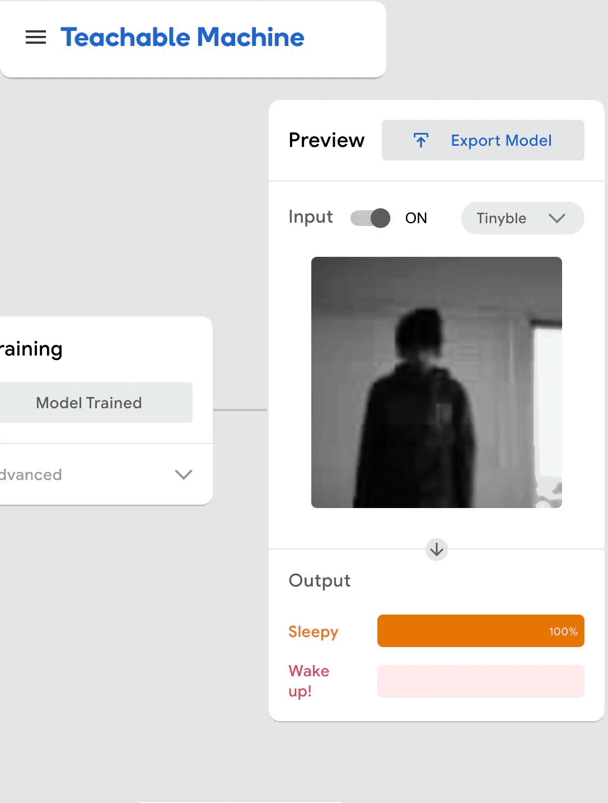
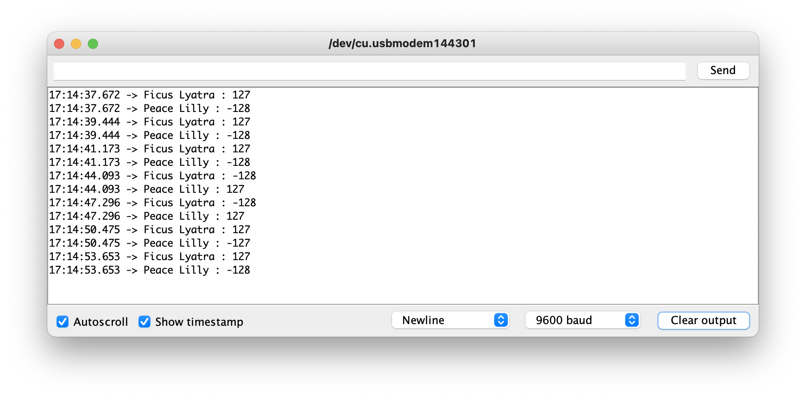

# Getting Started With Teachable Machine's Embedded Model

This guide is an overview of how to use Teachable Machine's Embedded Model.

Teachable Machine is a web based tool that lets you train models entirely in the browser with no coding required. [If you’ve never used Teachable Machine before, check out the getting started videos here to understand how it works.](https://www.youtube.com/watch?v=DFBbSTvtpy4) The embedded model is a smaller version of the standard image model, allowing you to run it on microcontrollers.
This guide will show you how to connect a camera and Arduino Nano 33 BLE to Teachable Machine to gather training samples, how to train your model, and finally how to export the model and run it on device.

## Requirements

This guide is meant for use with the Arduino Nano 33 BLE Sense and Nano 33 BLE, combined with the OV7670 Camera module. You'll need some female to female leads to connect the two.
We found the OV7670 Camera to be the most reliable, but you can also use the Arducam 2MP Plus. by replacing the `ImageProvider.cpp` file with the [one provided here](https://github.com/googlecreativelab/teachablemachine-community/blob/master/snippets/markdown/tiny_image/tiny_templates/arducam_image_provider/ImageProvider.cpp).
You'll also need a computer to run Teachable Machine, run the Arduino IDE, and run Processing.

## Software Setup

You'll need a few programs and libraries to communicate with your OV7670 Camera.

[Download and install the Arduino IDE from the Arduino Website](https://www.arduino.cc/en/software). Then:

### Install the Arduino_TensorFlowLite library

To install it, open the Arduino library manager in Tools -> Manage Libraries... and search for Arduino_TensorFlowLite. **Make sure to select Version 2.4.0-ALPHA or later and hit install.**

### Install the Arduino_OV767X library

To install it, open the Arduino library manager in Tools -> Manage Libraries... and search for Arduino_OV767X and install this as well.

### Processing IDE

We will use a simple Processing Sketch to connect our Arduino to Teachable Machine. [To get this running, first install the Processing IDE from the website here.](https://processing.org/download/)

You'll need a few additional libraries for our processing sketch as well. Open the Processing IDE. In the Menu Bar, go to Sketch -> Add Library -> Manage Libraries.

You'll need to install 2 libraries, the first is the ControlP5 library, and the second is called Websockets. Search for and install them.



## Hardware Setup

Use female to female leads to connect the Ov7670 Camera and Arduino. Depending on which Ov7670 variant you have, the pin labels may vary slighly, but the layout of the pins will be the same.

|0v7670 Camera Pin Name|Arduino pin name|
|----------------|----------------|
|3.3v|3.3v|
|GND|GND (either pin marked GND is fine)|
|SCL/SIOC|A5|
|SDA/SIOD|A4|
|VS/VSYNC|D8|
|HS/HREF|A1|
|PCLK|A0|
|MCLK/XCLK|D9|
|D7|D4|
|D6|D6|
|D5|D5|
|D4|D3|
|D3|D2|
|D2|D0 / RX|
|D1|D1 / TX|
|D0|D10|

Leave any remaining pins disconnected on the OV7670

## Training

Now that the camera is set up, let's connect it to Teachable Machine so we can use it as an input for your machine learning model.

### Run Uploader and Connector Sketches

Create a new teachable machine [image project here](https://teachablemachine.withgoogle.com/train) *Make sure to select 'Embedded model' so that you'll be able to export our model to your Arduino.*

Select **Device** as the input type, a window like this should pop up.



**First, Download [The TMUploader Arduino Sketch](https://github.com/googlecreativelab/teachablemachine-community/tree/master/snippets/markdown/tiny_image/tiny_templates/TMUploader)**, unzip it, and open it in the Arduino IDE by double clicking the .ino file. Make sure that you have selected Arduino Nano 33 inside of Tools -> Boards, and the correct port is selected under Tools -> Port. Upload this sketch to the Arduino. This sets up the Arduino to send images to teachable machine.

**Next Download the [The TMConnector Processing Sketch](https://github.com/googlecreativelab/teachablemachine-community/tree/master/snippets/markdown/tiny_image/tiny_templates/TMConnector)**, unzip it and open it in the Processing IDE by double clicking on the .pde file. Hit play in the upper left corner. You should see a window Like this come up:



Use the port select menu to choose the port for your Arduino. A good way to figure out what this should be is by referencing the port used in the Arduino IDE to upload the Arduino sketch

You should see the camera feed appear in the Processing App.

```text
Troubleshooting:

- If you see static or nothing coming from the camera, make sure all your wiring connections are tight and correct.
- If you see a flat gray screen, try adjusting the camera's focus so that it's able to correctly auto-expose.
```

Now hit 'Attempt to connect to device' on the Teachable Machine website. You should see a preview of your OV7670 Camera feed in the class window.

## Collect the Data

Set up your camera about a foot away from the objects you want to classify. If your camera preview looks like a blur, most likely the camera is out of focus. Spin the focus ring as in the video below until you see your object clearly.


Use the ‘Record’ button to collect samples inside of each class. The samples should contain pictures of what you want to classify in real world lighting.

For example, here’s a model that can tell the difference between two houseplants.



```text
Note: Remember that the results of any machine learning model depend on the examples you give it. Trying different examples is a core part of exploring machine learning. So, if it's not working as you intended, play around with different approaches for what examples you provide.
```

When you're done adding training data, hit Train and don't switch tabs.

## Test Your Model

Try your model out in the teachable machine preview window. Select Device from the input dropdown menu, you'll see the OV7670 Camera images start to be classified.



## Running your model on the Arduino

Hit Export model above the preview window in Teachable Machine. Select Tensorflow Lite, then Tensorflow Lite for Microcontrollers and Hit 'Download my Model'. This will convert your model in the background for a few moments, then download a zip folder containing an Arduino sketch with your model loaded.

*Close any open Processing Sketches* and upload this sketch to your Arduino. When the upload is complete, check the Serial Monitor. You will see the class names printed next to the confidence in each class.

Confidence scores range from -128 to 127

